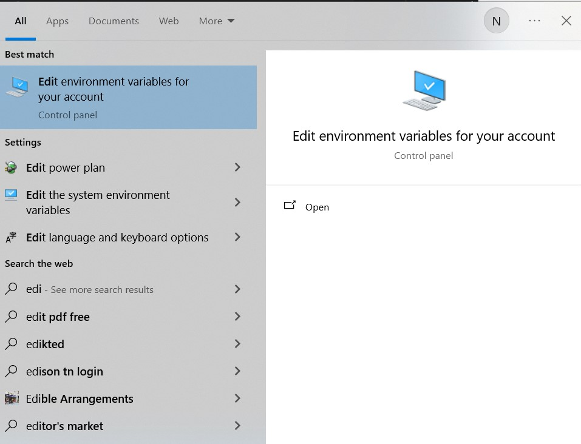
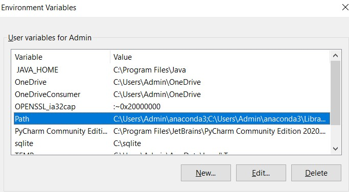
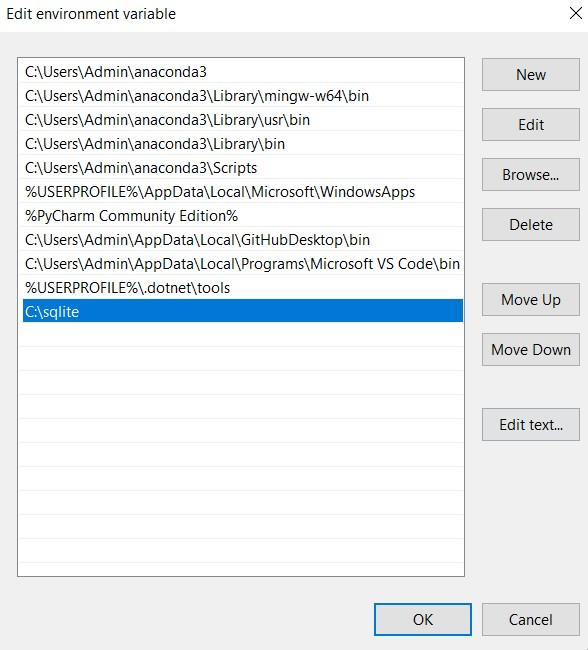

# Modern-Software-Tech-Group-2

Our Pokemon Group project

# Pokemon Auction App

This app was created for module IS631 Modern Software Solution. This app is similar to Carousell, serving as a online solution for buying/selling cards. Our innovation is through the use of a PSA grader to pre-grade the cards to ensure that cards being sold are genuine, and the buyer does not get scammed.

## Installation

---

### Installing SQLite3

To run the database, we use SQLite3 since it is a simple database for the webapp for now. In the future, we can run database on cloud sources.

1. Go to the [SQLite3 Download Page](https://www.sqlite.org/download.html) and download the correct version of SQLite3 depending on your computer's version
2. Extract out all packages and add them to the folder in `C:\User\YOUR_USERNAME`
3. Add the file to the environment variables
   3.1 Go to Start Bar and type `Edit environment variables for your account` 
   3.2 Go to user variables, and then click on `Path` 
   3.3 Add a new path for SQLite so that you can run it on your current user 
   3.4 Press Ok to close all environment variables path.

To verify the proper installation of SQLite3, close all open command prompts / terminals and run the following command

```
sqlite3
```

You should see SQLite3 command line.

### Install Python Packages

Below are the packages required for Python. If you need anymore, please add them to this list.

```
pip install -r requirements.txt
```

```
pip install uvicorn
pip install fastapi
pip install python-multipart
pip install pytesseract
```

## Setting up the DB

This step is similar to lesson 4 where you run a simple data server.

```
# Init alembic
alembic init migrations
```

Open `alchemic.ini` file and change the sqlite database URL

```
# Change Alchemy URL
sqlalchemy.url = sqlite:///./app.db
```

Configure the `migrations/env.py` file to contain models and include meta data

```
from app.db.db import Base
from app.models.auction import Auction
from app.models.card import Card
from app.models.profile import Profile
from app.models.notications import Notification

target_metadata = Base.metadata
```

Create Migration File

```
alembic revision --autogenerate -m "Init Auction App"
```

Apply Migration

```
alembic upgrade head
```

## Running the Application

```
uvicorn app.main:app --reload
```

## Installing Tesseract OCR

Tesseract OCR is required for extracting text from Pokémon cards in this project.

## Download Tesseract:

Go to [the Tesseract Download Page](https://github.com/UB-Mannheim/tesseract/wiki).  
Download the correct version based on your computer's operating system (Windows, Mac, or Linux).

## Install Tesseract:

Follow the installation steps provided on the download page.  
Take note of the installation path (e.g., `C:\Program Files\Tesseract-OCR`).

### **Adding Tesseract to Environment Variables (Windows)**

1. Go to the **Start Menu** and search for **Edit environment variables**.
2. Under **User Variables**, select **Path** and click **Edit**.
3. Click **New**, then add the Tesseract installation path (e.g., `C:\Program Files\Tesseract-OCR`).
4. Click **OK** to save changes and close the window.

### **Verify Tesseract Installation**

Open a **Command Prompt** or **Terminal**, then run the following command:

```sh
tesseract -v
```
